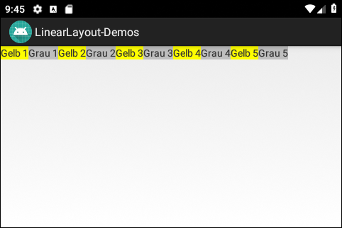
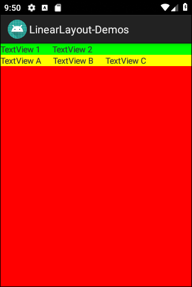
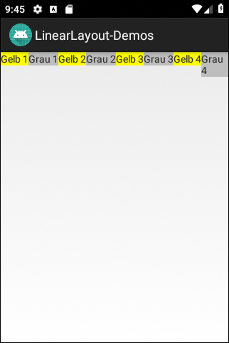
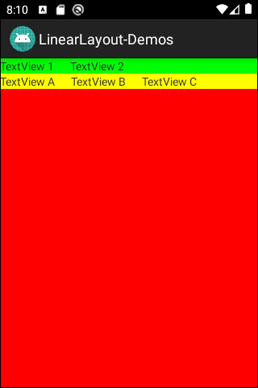
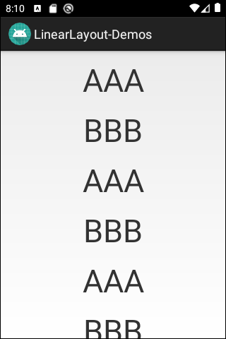

# Android-App "LinearLayout-Demo" #

 

Dieses Repo enthält eine native Android-App (Java).
Die App enthält mehrere Activities, die das
[LinearLayout](https://developer.android.com/develop/ui/views/layout/linear?hl=de)
verwenden und folgende Dinge demonstrieren:
* Verhalten bei Platzmangel
* Verschachtelte *LinearLayout*-Instanzen
* *ScrollView* mit *LinearLayout*

 

----

## Screenshots ##

 

  

 

  

  

 

----

## License ##

 

See the [LICENSE file](LICENSE.md) for license rights and limitations (BSD 3-Clause License).

 
