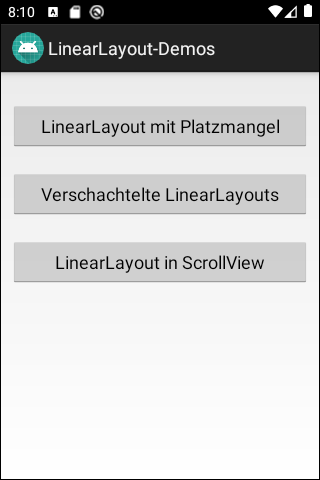

# Android-App "LinearLayout-Demo"

App contains several layout files using [*LinearLayout*](https://developer.android.com/reference/android/widget/LinearLayout).
 Exactly one of these layout files must be loaded in method *onCreate()*
 of class *MainActivity*.

 

Comments (JavaDoc) and UI texts are in German.

 

----
## Screenshots

First layout file `platzmangel.xml` shows what happens when there is lack of space to display all elements in a *LinearLayout*: 
  

  

Second layout file `verschachtelt.xml` shows that *LinearLayouts* (like other layouts) can be nested:

 

----
# License

See the [LICENSE file](LICENSE.md) for license rights and limitations (BSD 3-Clause License).
