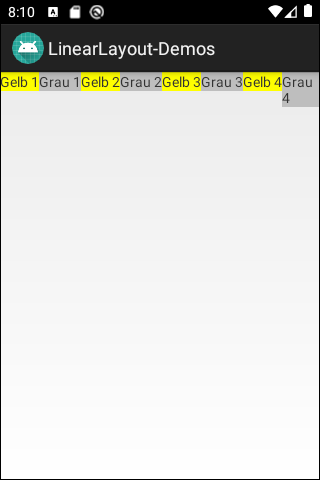

# Android-App "LinearLayout-Demo"

This app contains several activities based on *LinearLayout*.
The following aspects of using *LinearLayout* in Android are shown:
* Behaviour when *LinearLayout* is not wide enought to display all its child elements.
* Nested *LinearLayout*.
* *ScrollView* containing a *LinearLayout*.

 

----
## Screenshots

 

  

  

  

  

  

----
# License

See the [LICENSE file](LICENSE.md) for license rights and limitations (BSD 3-Clause License).
